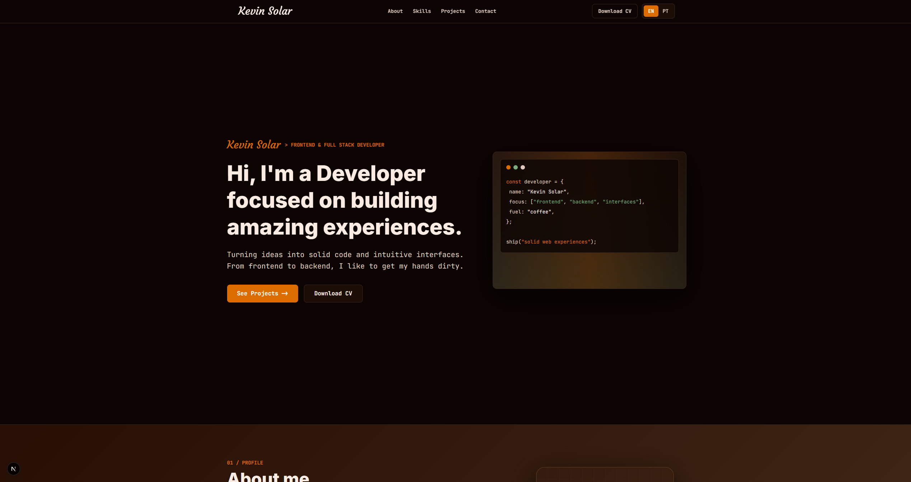

# Kevin Solar Portfolio

Personal portfolio built with Next.js, focused on presenting my work, stack, and contact channels through a clean Coffee & Code visual identity.



## About

This project is a bilingual landing page for my developer portfolio. It highlights selected projects, technologies I work with, a short personal intro, and direct contact links.

The interface follows a dark coffee-inspired design system with warm accents, monospace body copy, and a compact layout made for scanning quickly on desktop and mobile.

## Features

- Bilingual content with English as the default language
- EN/PT language toggle persisted with `localStorage`
- Static, optimized landing page using the App Router
- Reusable button component for internal and external links
- Isolated client-side logic only where needed
- Project cards with optimized images via `next/image`
- Horizontal project rail on mobile
- Responsive layout for mobile, desktop, and wide screens
- SEO metadata and Open Graph basics

## Tech Stack

- Next.js 16
- React 19
- TypeScript
- Tailwind CSS 4
- `next/font`
- `next/image`

## Project Structure

```txt
app/
  components/       Reusable UI pieces
  components/icons/ SVG icons as React components
  data/             Portfolio content and typed data
  sections/         Page sections
  globals.css       Theme tokens and global styles
  layout.tsx        Fonts and metadata
  page.tsx          Landing page composition
public/             Project screenshots and static files
```

## Getting Started

Install dependencies:

```bash
pnpm install
```

Run the development server:

```bash
pnpm dev
```

Open:

```txt
http://localhost:3000
```

## Available Scripts

```bash
pnpm dev
pnpm build
pnpm start
pnpm lint
```

## Content

Most editable portfolio content lives in:

```txt
app/data/portfolio.ts
```

Project screenshots live in:

```txt
public/
```

To add a new project, add a new item to `projects.items` and reference an image from `public`, for example:

```ts
image: {
  src: "/print-project.png",
  alt: "Project screenshot",
}
```

## Notes

This portfolio is intentionally simple: no CMS, no heavy carousel library, and no unnecessary client-side state. The goal is to keep it fast, maintainable, and easy to update.

## Author

Kevin Solar

- [LinkedIn](https://linkedin.com/in/kevinsolar)
- [GitHub](https://github.com/kevinsolar)
